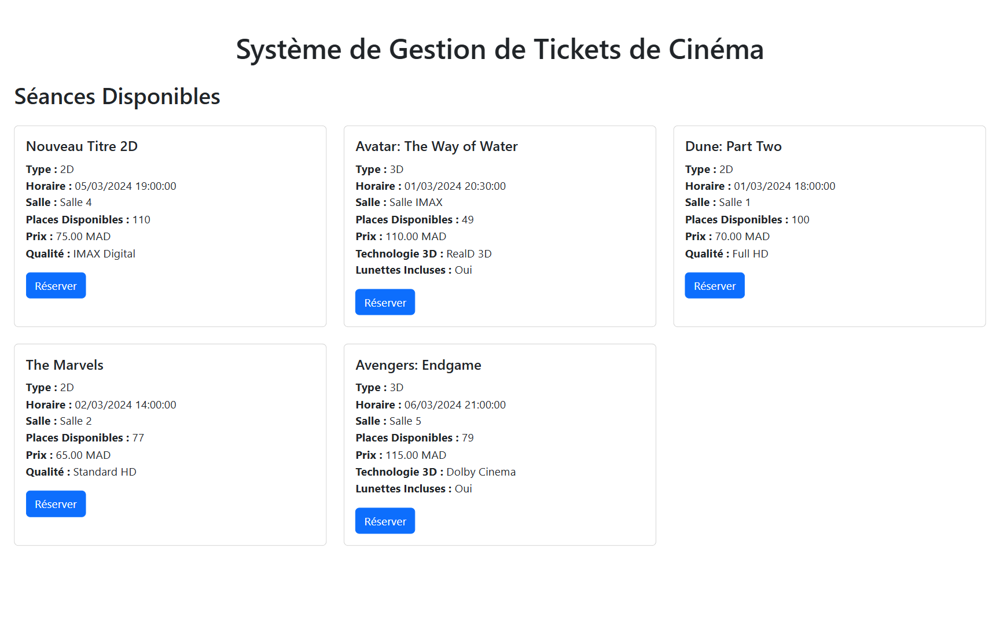

# MINI-PROJET - SYSTÈME DE GESTION DE TICKETS DE CINÉMA

### Application pour Caissiers de Cinéma

Ce projet est une application web développée pour les caissiers d'un cinéma, visant à faciliter la gestion quotidienne des ventes de tickets et la consultation des séances programmées. Il sert d'exemple de consommation d'un backend PHP RESTful pour une application front-end en JavaScript pur.

---

## Architecture du Projet

L'application est structurée en deux parties principales :

*   **Backend PHP :** Un service RESTful développé en PHP, basé sur un boilerplate existant et étendu pour gérer les entités `Client`, `Seance` (avec `Seance2D` et `Seance3D`), et `Ticket`.
*   **Frontend JavaScript (Vanilla JS) :** Une Single Page Application (SPA) développée en JavaScript natif, s'appuyant sur l'approche **modulaire** du boilerplate initial (`native-spa`). Cette architecture offre une structure claire et organisée pour la gestion des fonctionnalités du cinéma.

*(Le boilerplate original incluait également une version `with-jquery` qui n'a pas été utilisée pour cette implémentation.)*

---

## Fonctionnalités Implémentées (Frontend)

L'application front-end permet aux caissiers d'effectuer les opérations suivantes, avec une interface utilisateur simplifiée et axée sur la réservation de tickets :

*   **Consultation de la Programmation des Séances :**
    *   Affichage d'une liste de toutes les séances disponibles.
    *   Chaque séance présente ses caractéristiques : film, horaire, salle, places disponibles, prix calculé (incluant TVA et surcoût 3D), type de projection (2D/3D) avec attributs spécifiques (qualité d'image pour 2D, technologie 3D et inclusion de lunettes pour 3D).

*   **Réservation de Tickets :**
    *   Pour chaque séance disponible, un bouton "Réserver" permet d'ouvrir un formulaire de réservation dédié.
    *   Ce formulaire permet au caissier de :
        *   **Enregistrer les informations du client :** Nom, email, et numéro de téléphone. L'application vérifie si le client existe déjà via son email ; si oui, elle utilise le client existant, sinon elle en crée un nouveau.
        *   **Spécifier le nombre de places :** Le nombre de places est validé pour s'assurer qu'il ne dépasse pas 5 tickets par client (pour une séance donnée) et qu'il y a suffisamment de places disponibles pour la séance.
        *   **Calcul automatique des coûts :** Le montant total est calculé en fonction du nombre de places et du prix de la séance (qui inclut déjà la TVA et le coût des lunettes 3D si applicable).
    *   Les places disponibles pour la séance sont automatiquement décrémentées après une réservation réussie.

*   **Feedback Utilisateur :**
    *   Des notifications "Toast" s'affichent en temps réel pour confirmer le succès des opérations (réservation, mise à jour des places) ou signaler les erreurs (places insuffisantes, client ayant dépassé la limite de tickets, erreurs de validation, etc.).

---

## Installation et Configuration

### Prérequis

*   Un serveur HTTP (Apache, Nginx, ou l'extension Live Server de VS Code pour le frontend).
*   Votre backend PHP `cinema_backend` doit être configuré et accessible (ex: `http://cinema.test/cinema_backend/public`).

### Étapes :

1.  **Cloner le dépôt (si applicable) ou obtenir les fichiers du projet.**
2.  **Positionner le Frontend :** Placez le dossier `cinema_frontend/native-spa` sur votre serveur HTTP.
3.  **Configuration de l'URL du Backend (très important) :**
    Pour que le frontend puisse communiquer avec votre backend PHP, vous devez ajuster la variable `baseUrl` dans les fichiers de services API JavaScript.

    Vérifiez et adaptez cette variable dans les fichiers suivants :
    *   `cinema_frontend/native-spa/js/api/clientService.js`
    *   `cinema_frontend/native-spa/js/api/seanceService.js`
    *   `cinema_frontend/native-spa/js/api/ticketService.js`

    **Exemple de `baseUrl` (à adapter à votre configuration locale) :**
    ```javascript
    const baseUrl = 'http://cinema.test/cinema_backend/public'; 
    ```
    Assurez-vous que cette URL pointe précisément vers le dossier `public` de votre backend PHP.

4.  **Lancer l'Application :**
    Ouvrez le fichier `index.html` de `cinema_frontend/native-spa` dans votre navigateur via votre serveur HTTP (par exemple, `http://localhost/cinema_frontend/native-spa/index.html` ou `http://votre-domaine.test/native-spa/index.html`).

---

## Aperçu de l'Application

*(Vous pouvez ajouter un screenshot ici une fois que l'interface est affichée sur votre navigateur.)*


*(Remplacez `screenshots/cinema_app_overview.png` par le chemin réel de votre propre capture d'écran, ou supprimez cette ligne si vous ne souhaitez pas en inclure.)*

---

Ce `README.md` est maintenant prêt à être utilisé. Il donne un bon aperçu de votre projet et des étapes nécessaires pour le lancer.